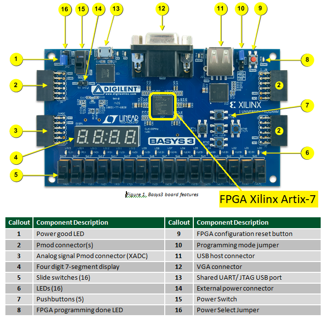
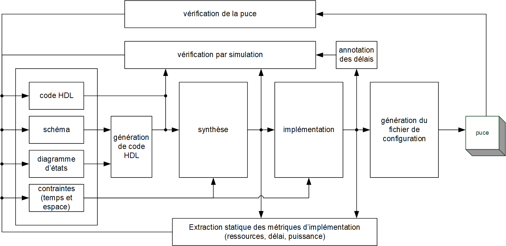

-----------------------------------------------------------------------

<table>
<tr>
<td></td>
<td><h2>INF3500 - Conception et réalisation de systèmes numériques
<br><br>Automne 2023
<br><br>Laboratoire #1
<br>Flot de conception de systèmes numériques
</h2></td>
</tr>
</table>

------------------------------------------------------------------------

# Processeur de fonctions combinatoires

------------------------------------------------------------------------

## Objectifs

À la fin de ce laboratoire, vous serez capable d'appliquer le flot de conception d'un système numérique à l'aide d'outils de conception :

* modéliser un module combinatoire en VHDL;
* vérifier le module par simulation à l'aide d'un banc d'essai;
* synthétiser et implémenter le module; et,
* générer le fichier de configuration pour le FPGA, programmer le FPGA et vérifier le fonctionnement du module sur une carte de développement.

## Préparation au laboratoire

Avant le début de la période de laboratoire, suivez les étapes suivantes:

1. Obtenir [une carte Digilent Basys 3](https://store.digilentinc.com/basys-3-artix-7-fpga-trainer-board-recommended-for-introductory-users/). Il y a plusieurs fournisseurs, mais le meilleur choix est d'acheter une carte d'un/e étudiant/e d'un trimestre passé - voir le serveur Discord. Sinon, le mieux est probablement d'acheter directement du manufacturier Digilent. On peut aussi utiliser [une carte Digilent Nexys A7](https://digilent.com/shop/nexys-a7-fpga-trainer-board-recommended-for-ece-curriculum/), mais les présentes instructions sont particularisées pour la Basys 3.
2. Obtenir un câble USB pour relier votre ordinateur à la carte. Le connecteur de la carte [est de type USB 2.0 Micro-B](https://en.wikipedia.org/wiki/USB_hardware). Vérifiez de quel type de connecteur USB votre ordinateur a besoin. Les plus fréquents sont USB A (Type-A) et [USB-C](https://en.wikipedia.org/wiki/USB-C).
3. Installer les outils suivants sur votre ordinateur - attention, il faut prévoir au moins deux heures pour le téléchargement et l'installation :
    * [Active-HDL, en version étudiante](https://www.aldec.com/en/products/fpga_simulation/active_hdl_student), de [la compagnie Aldec](https://www.aldec.com/).
<br>[Note : Vous pouvez utiliser tout éditeur de texte de votre choix pour entrer votre code VHDL, et l'outil de votre choix pour en faire la simulation.
Cependant, dans le cadre du cours, seul Active-HDL sera officiellement pris en charge.]
    * La version 2021.2 de [Xilinx Vivado ML](https://www.xilinx.com/support/download.html), de la compagnie [Xilinx](https://www.xilinx.com/). [Des captures d'écran correspondant à l'installation sont disponibles](figures/Installation_Xilinx_Vivado_2021.pdf). L'utilisation de cette version est fortement recommandée, car certaines équipes ont eu des difficultés avec les nouvelles versions.
4. Choisir un/e co-équipier/ère. Vous pouvez utiliser le forum du cours. Il peut être possible de travailler seul(e), pour cela, il faut en discuter avec le chargé de laboratoire qui décidera en fonction du nombre de demandes. Il n'y aura pas d'équipe de trois personnes.
5. Vous assurer d'avoir accès [à la matière du cours de la semaine 1](https://moodle.polymtl.ca/mod/folder/view.php?id=51941) : Introduction, et en particulier :
    * les diapositives de la série 0103FlotDeConception; et,
    * les diapositives de la série 0104IntroVHDL.

## Partie 0 : Mise en oeuvre de la carte Basys 3

La [carte Digilent Basys 3](https://store.digilentinc.com/basys-3-artix-7-fpga-trainer-board-recommended-for-introductory-users/) comporte tous les éléments nécessaires pour se familiariser avec la technologie des FPGA. Elle contient des interfaces simples qui permettent à l'utilisateur d'interagir avec le programme implémenté dans le FPGA.

Suivez les étapes suivantes :

1. Vérifiez que le cavalier (*jumper*) de sélection de l'alimentation (item 16 dans la figure) est bien en mode USB, c'est-à-dire la position du bas.
2. Reliez le port USB de la carte Basys 3 (item 13 dans la figure) à votre ordinateur à l'aide d'un câble USB. Le port USB de la carte sert à trois fonctions simultanées :
    * l'alimentation de la carte en énergie;
    * la programmation du FPGA par son port JTAG; et,
    * la connexion à l'ordinateur via un port série (Windows : COM port) sur les pattes A18 et B18 du FPGA.
3. Activez le commutateur d'alimentation (item 15 dans la figure) et confirmez que la DEL d'alimentation (item 1 dans la figure) est bien allumée.
4. Si un programme était déjà présent dans la mémoire Flash de la carte, il se chargera dans le FPGA et commencera à s'exécuter.
    * Pour cela, il faut que le cavalier de configuration du FPGA (item 10 dans la figure) soit placé dans la position "SPI Flash", c'est-à-dire sur les deux pattes du haut.
    * En tout temps, on peut forcer le chargement du programme présent dans la mémoire Flash en appuyant sur le bouton "PROG" (item 9 dans la figure).
    * En supposant que le programme initial du manufacturier soit chargé, vous devriez voir un compte 0-9 sur les affichages à sept segments (item 4 dans la figure) et vous devriez pouvoir allumer et éteindre les DEL (item 6 dans la figure) à l'aide des commutateurs (item 5 dans la figure). Les boutons (item 7 dans la figure) ont aussi des effets sur les affichages à sept segments.

Consultez [le manuel de l'utilisateur](https://reference.digilentinc.com/reference/programmable-logic/basys-3/reference-manual) disponible en ligne pour tous les détails sur la carte Basys 3.

  
Vue d'ensemble de la carte Basys 3 [Source de l'image : [Digilent](https://reference.digilentinc.com/reference/programmable-logic/basys-3/reference-manual)]

La documentation équivalente pour [la carte Nexys A7 est disponible en ligne]( https://store.digilentinc.com/nexys-a7-fpga-trainer-board-recommended-for-ece-curriculum/).

## Partie 1 : Appliquer le flot de conception à du code VHDL existant

**Sur votre machine, créez un répertoire "C:\inf3500". Il est très important d'utiliser un répertoire à la racine de votre disque dur, car Vivado nécessite des chemins (*path*) très court et sans accents ni espaces. Faire autrement pourrait amener à des erreurs.**

Clonez votre dépôt Git dans ce dossier.

### a. Vue d'ensemble du flot

Le flot de conception de systèmes numériques est montré à la figure suivante. Consultez les diapositives du cours, série 0103, pour une description détaillée.

 Flot de conception de systèmes numériques

### b. Création d'un espace de travail et d'un projet dans Active-HDL

Créez un répertoire "C:\inf3500\workspaces" dans lequel vous allez créer vos projets Active-HDL. Les projets Active-HDL ne sont pas à remettre, juste les fichiers sources.

Lancez Active-HDL, créez un espace de travail (*workspace*) et créez un projet (*design*). Ajoutez-les fichiers .vhd à votre projet. Décochez la case *Make local copy*, dans le cas échéant, vous devrez copier du projet vers votre dépôt Git les fichiers .vhd pour la remise.

Pour de l'aide concernant l'utilisation de Active-HDL, vous pouvez suivre [le tutoriel proposé par Aldec](https://www.aldec.com/en/support/resources/documentation/articles/1054) ou tout autre que vous trouverez en ligne en cherchant par exemple "active-hdl student edition user guide" ou "active-hdl tutorial".

### c. Correction des erreurs de syntaxe

Le fichier `demo_combinatoire.vhd` comporte cinq erreurs de syntaxe. Pour vous aider à les trouver, dans Active-HDL faites `Design > Compile` ou pressez la touche F11. Attention, il est important de spécifier la bonne version de VHDL à utiliser par le compilateur, avec [Design > Settings > Compilation > VHDL Compiler > Language Specification > Standard version : VHDL 1076-2008](figures/Active-HDL-VHDL-compiler.jpg). On peut aussi effectuer la compilation directement dans la console de Active-HDL avec la commande :

`acom -2008 votre-chemin\inf3500\labo1\demo_combinatoire.vhd`

Notez et corrigez les cinq erreurs une à la fois. Ajoutez des commentaires dans votre fichier `demo_combinatoire.vhd` indiquant les erreurs que vous avez corrigées. [Recommandation : Consultez les diapositives du cours, série 0104, pour une brève introduction au langage VHDL.]

### d. Vérification par simulation et correction des erreurs fonctionnelles

Dans Active-HDL, définissez la paire entité/architecture demo_combinatoire_tb(arch) comme unité principale (Top-level) :
* par `Design > Settings > General > Top-level`; ou 
* en cliquant le bouton de droite de la souris sur demo_combinatoire_tb(arch) dans la fenêtre des fichiers, puis en choisissant `Set as Top-Level`.

Lancez la simulation :
* en cliquant sur le symbole de lecture (triangle vert) dans la barre d'outils;
* en pesant les touches alt-F5; ou,
* en entrant les commandes suivantes dans la console :

```
asim demo_combinatoire_tb
run
```

Créez un chronogramme avec la commande `File > New > Waveform` ou en cliquant l'icône correspondant dans la barre d'outils. À partir de l'onglet *Structure*, disponible en bas à gauche de l'écran, traînez les signaux de l'entité sous test (UUT : demo_combinatoire(arch1)) dans votre chronogramme. Il peut être nécessaire de cliquer sur le petit '+' de l'entité demo_combinatoire_tb(arch).

Dans la console, on peut relancer la simulation avec la commande `restart` et arrêter la simulation avec la commande `endsim`. On peut cacher ou activer la console, ou y amener le focus, en tapant alt-0 (alt-zéro).

[Note : vous pouvez aussi utiliser un autre simulateur de votre choix, comme Vivado ou bien GHDL, le simulateur libre de VHDL, mais ces outils ne sont pas pris en charge dans le cours.]

En consultants les spécifications données dans les commentaires et les résultats de la simulation, corrigez les erreurs fonctionnelles dans le fichier demo_combinatoire, indiquez en commentaires les erreurs que vous avez corrigées, et remettez le fichier.

### e. Lecture des fichiers source et synthèse

La synthèse s'effectue avec le logiciel Vivado de Xilinx. On peut utiliser l'interface graphique ou la ligne de commande. La ligne de commande est beaucoup plus fiable, plus robuste et plus rapide et c'est elle qui est décrite ici.

Sous votre répertoire "inf3500\labo1", créez un répertoire "synthese-implementation". Lancez une fenêtre d'invite de commande ("cmd" sous Windows) et naviguez au répertoire "inf3500\labo1\synthese-implementation".

De ce répertoire, lancez Vivado en mode script avec la commande [repertoire-d-installation-de-Vivado]\bin\vivado -mode tcl, où [repertoire-d-installation-de-Vivado] est probablement C:\Xilinx\Vivado\2021.2 si votre système d'exploitation est Windows.

Dans la fenêtre, à l'invite de commande Vivado%, entrez les commandes suivantes [Remarque : attention, alors que Windows spécifie des chemins avec le '\\', dans l'invite de commande de Vivado il faut utiliser plutôt '/'] :

```
read_vhdl -vhdl2008 ../sources/top_labo_1.vhd
read_vhdl -vhdl2008 ../sources/demo_combinatoire.vhd

# lecture du fichier de contraintes xdc; choisir la ligne qui correspond à votre carte
read_xdc ../xdc/basys_3_top.xdc
#read_xdc ../xdc/nexys_a7_50t_top.xdc
#read_xdc ../xdc/nexys_a7_100t_top.xdc

# synthèse - choisir la ligne qui correspond à votre carte
synth_design -top top_labo_1 -part xc7a35tcpg236-1 -assert
#synth_design -top top_labo_1 -part xC7a50TCSG324 -assert
#synth_design -top top_labo_1 -part xC7a100TCSG324 -assert
```

On remarque que :

* `top_labo_1.vhd` est un fichier de code VHDL facilitant l'interface entre le module demo_combinatoire et les interfaces physiques sur la carte - il sert uniquement à renommer les ports ici;
* `demo_combinatoire.vhd` est un fichier de code VHDL décrivant le module à synthétiser;
* le commutateur -vhdl2008 spécifie quelle version de VHDL utiliser;
* les fichiers `*.xdc` sont des fichiers de texte contenant les contraintes d'implémentation, entre autres l'assignation des pattes du FPGA à des signaux du module VHDL top_labo_1;
* `-part xc7a35tcpg236-1` est le modèle spécifique du FPGA présent sur la carte et cible de la synthèse.

Inspectez la fenêtre d'invite de commandes et les fichiers du répertoire "synthese-implementation". S'il y a des erreurs, corrigez-les si nécessaire et recommencez. En particulier, vous trouverez un fichier vivado.log qui retrace toutes les activités et un fichier vivado.jou qui journalise vos commandes. Les produits de la synthèse sont dans un répertoire .Xil.

### f. Implémentation

L'implémentation est divisée en deux parties : le placement des fonctions logiques à des ressources spécifiques du FPGA, et le routage des interconnexions entre ces ressources. Entrez les commandes suivantes :

```
place_design
route_design
```

Inspectez la fenêtre d'invite de commandes et les fichiers du répertoire "synthese-implementation". S'il y a des erreurs, corrigez-les si nécessaire et recommencez.

### g. Génération du fichier de configuration

Entrez la commande suivante :

`write_bitstream -force top_labo_1.bit`

Inspectez la fenêtre d'invite de commandes et les fichiers du répertoire "synthese-implementation". S'il y a des erreurs, corrigez-les si nécessaire et recommencez.

### h. Programmation de la puce

La carte doit être reliée à votre ordinateur et allumée, conformément à la partie 2. Entrez les commandes suivantes :

```
open_hw_manager
connect_hw_server
get_hw_targets
open_hw_target

# puis choisir les trois lignes qui correspondent à votre carte
current_hw_device [get_hw_devices xc7a35t_0]
set_property PROGRAM.FILE {top_labo_1.bit} [get_hw_devices xc7a35t_0]
program_hw_devices [get_hw_devices xc7a35t_0]

#current_hw_device [get_hw_devices xc7a50t_0]
#set_property PROGRAM.FILE {top_labo_1.bit} [get_hw_devices xc7a50t_0]
#program_hw_devices [get_hw_devices xc7a50t_0]

#current_hw_device [get_hw_devices xc7a100t_0]
#set_property PROGRAM.FILE {top_labo_1.bit} [get_hw_devices xc7a100t_0]
#program_hw_devices [get_hw_devices xc7a100t_0]
```

Les commandes données ici établissent entre autres la communication entre votre ordinateur et le FPGA sur la carte. Il arrive que la synchronisation ne se fasse pas correctement du premier coup. Si c'est le cas, relancez-les commandes une à une jusqu'à ce que ça fonctionne et que le FPGA soit programmé. Beaucoup de problèmes sont aussi causés par un câble déficient.

### i. Vérification de la puce

Vous pouvez maintenant vérifier le comportement correct du module en activant les quatre commutateurs de droite et en observant les DEL.

Si le comportement n'est pas conforme aux spécifications ... il faut alors retourner au code VHDL pour le corriger, puis recommencer.

### j. Toutes les commandes en un seul script

Toutes les commandes vous sont fournies dans le fichier `labo-1-synth-impl.tcl` que vous pouvez éditer à votre guise.

En général, il n'est pas nécessaire de refaire toutes les étapes précédentes quand une étape ne fonctionne pas. On peut en général ne refaire que l'étape qui a flanché.

## Partie 2 : Amélioration du module pour cinq entrées

Modifiez le module demo_combinatoire pour qu'il fonctionne avec une valeur de W = 5. Répétez toutes les étapes du flot de conception. Nommez votre fichier "demo_combinatoire_ameliore.vhd".

Utilisez le banc d'essai demo_combinatoire_tb.vhd pour vérifier le fonctionnement correct de votre module. Modifiez la valeur de W_tb. Quand vous êtes satisfait/es que votre code est correct, passez à son implémentation sur la carte.

Modifiez le fichier top_labo_1.vhd pour accommoder une entrée de plus :
* modifiez la valeur de W à la ligne 33
* utilisez le commutateur #11 comme 5e entrée, à la ligne 50

Faites la synthèse, l'implémentation, la génération du fichier de configuration, la programmation de la puce et la vérification de la puce.

## Partie 3 : Bonus - au-delà du A

**Mise en garde**. *Compléter correctement les parties 1 et 2 peut donner une note de 17 / 20 (85%), ce qui peut normalement être interprété comme un A. La partie 3 demande du travail supplémentaire qui sort normalement des attentes du cours. Il n'est pas nécessaire de la compléter pour réussir le cours ni pour obtenir une bonne note. Il n'est pas recommandé de s'y attaquer si vous éprouvez des difficultés dans un autre cours. La partie 3 propose un défi supplémentaire pour les personnes qui souhaitent s'investir davantage dans le cours INF3500 en toute connaissance de cause.*

a. Proposez **deux** manières de décrire le module en VHDL afin qu'il accommode un grand nombre d'entrées. Expliquez complètement vos deux suggestions à l'aide d'exemples.

b. Remettez le code de votre module qui fonctionne avec W = 16, ainsi que le fichier de configuration correspondant qui peut être programmé sur la carte utilisant les 16 commutateurs.

c. Remettez le code de votre module qui fonctionne avec toute valeur de W entre 3 et 63 inclusivement.


## Remise

La remise se fait directement sur votre dépôt Git. Faites un 'push' régulier de vos modifications, et faites un 'push' final avant la date limite de la remise. Ne modifiez pas la structure des fichiers. Assurez-vous que les changements dans votre projet Active-HDL sont bien aussi dans votre dépôt Git. Consultez le barème de correction pour la liste des fichiers à remettre.

**Directives spéciales :**
* Sauf où c'est spécifié explicitement, ne modifiez pas les noms des fichiers, les noms des entités, les listes des *generics*, les listes des ports ou les noms des architectures.
* Remettez du code de très bonne qualité, lisible et bien aligné, bien commenté. Indiquez clairement la source de tout code que vous réutilisez ou duquel vous vous êtes inspiré/e.
* Modifiez le fichier [rapport.md](rapport.md) pour spécifier quelle carte vous utilisez. Si ce n'est pas la Basys 3, remettez aussi votre fichier *.xdc, par exemple un fichier nexys_a7_top.xdc.

## Barème de correction

Le barème de correction est progressif. Il est relativement facile d'obtenir une note de passage (> 10) au laboratoire et il faut mettre du travail pour obtenir l'équivalent d'un A (17/20). Obtenir une note plus élevée (jusqu'à 20/20) nécessite plus de travail que ce qui est normalement demandé dans le cadre du cours et plus que les 9 heures que vous devez normalement passer par semaine sur ce cours.

Critères | Points
-------- | ------
Partie 1 c. : fichier demo_combinatoire.vhd corrigé et commenté montrant chacune des erreurs de syntaxe | 5
Partie 1 d. : fichier demo_combinatoire.vhd corrigé et commenté montrant chacune des erreurs de fonctionnalité | 7
Partie 2 : fichier demo_combinatoire_ameliore.vhd et le fichier de configuration correspondant top_labo_1.bit pour W = 5 | 3
Qualité, lisibilité et élégance du code : alignement, choix des identificateurs, qualité et pertinence des commentaires, respect des consignes de remise incluant les noms des fichiers, orthographe, etc. | 2
Pleine réussite du labo | 17

Bonus | Points
----- | ------
Partie 3 a. : Votre réponse dans le fichier [rapport.md](rapport.md) | 1
Partie 3 b. : Votre code dans un fichier demo_combinatoire_bonus_3b.vhd et un fichier de configuration top_labo_1_bonus_partie_3b.bit correspondant | 1
Partie 3 c. : Votre code dans un fichier demo_combinatoire_bonus_3c.vhd | 1
Maximum possible sur 20 points | 20

## Références pour creuser plus loin

Les liens suivants ont été vérifiés en septembre 2023.

- Aldec Active-HDL Manual : accessible en faisant F1 dans l'application, et accessible [à partir du site de Aldec](https://www.aldec.com/en/support/resources/documentation/manuals/).
- Tous les manuels de Xilinx :  <https://www.xilinx.com/products/design-tools/vivado/vivado-ml.html#documentation>
- Vivado Design Suite Tcl Command Reference Guide : <https://www.xilinx.com/content/dam/xilinx/support/documentation/sw_manuals/xilinx2021_1/ug835-vivado-tcl-commands.pdf>
- Vivado Design Suite User Guide - Design Flows Overview : <https://www.xilinx.com/support/documentation/sw_manuals/xilinx2020_2/ug892-vivado-design-flows-overview.pdf>
- Vivado Design Suite User Guide - Synthesis : <https://www.xilinx.com/support/documentation/sw_manuals/xilinx2020_2/ug901-vivado-synthesis.pdf>
- Vivado Design Suite User Guide - Implementation : <https://www.xilinx.com/support/documentation/sw_manuals/xilinx2020_2/ug904-vivado-implementation.pdf>