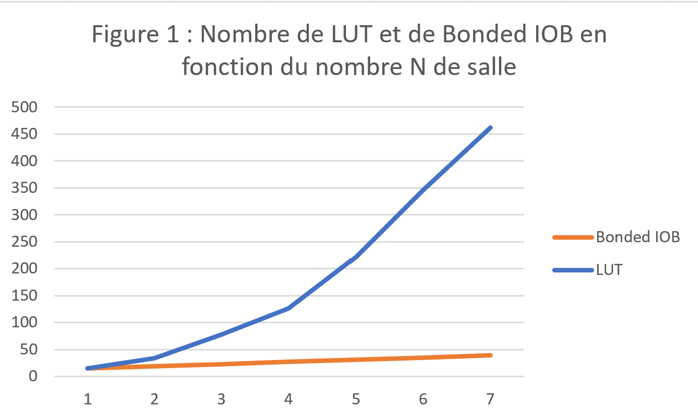

------------------------------------------------------------------------

# INF3500 - labo 2 - automne 2023
# Équipe **nom-d-équipe-ici**

Membre #1 : **Michaud, Maël, 2209239**

Membre #2 : **Rouleau, Thomas, 2221053**

------------------------------------------------------------------------

## Partie 1 : Conception d'un module combinatoire

Voici un lien vers notre fichier modifié : [musee_labo_2.vhd](sources/musee_labo_2.vhd).

## Partie 2 : Banc d'essai

Voici un lien vers notre fichier modifié : [musee_labo_2_tb.vhd](sources/musee_labo_2_tb.vhd).

Afin de pouvoir vérifier notre module, nous avons adopté la stratégie de test exhaustif. Il s'agit d'un banc d'essai complet avec observation et évaluation des réponses à l'aide des énoncés *report* et *assert* afin d'effectuer une comparaison automatisé. Nous avons donc testé toutes les combinaisons possibles d'entrées et vérifié les sorties à l'aide de l'énoncé *assert*. Cela permet de confirmer que le module à le comportement attendu.

## Partie 3 : Synthèse et implémentation sur la carte

**Faire un choix et garder seulement une option.**

Nous utilisons la carte Basys 3.

Voici un lien vers notre fichier de configuration final : [top_labo_2.bit](synthese-implementation/top_labo_2.bit)

## Partie 4A : Bonus

Voici un lien vers notre fichier modifié : [musee_labo_2.vhd](sources/musee_labo_2.vhd).

## Partie 4B : Ressources

Voici le nombre de ressources disponibles dans notre FPGA.

Slice LUTs | Slice Registers | F7 Muxes | F8 Muxes | Bonded IOB
---------- | --------------- | -------- | -------- | ----------
20800 | 41600 | 16300 | 8150 | 106

Voici le nombre de ressources utilisées par notre unité musee_labo_2 pour différentes valeurs des generics.

Nombre de salles | Slice LUTs | Slice Registers | F7 Muxes | F8 Muxes | Bonded IOB
--- | ---------- | --------------- | -------- | -------- | ------------
8 | 15   | 0         | 0  | 0  | 15
12 | 34    | 0         | 0  | 0  | 19
16 | 78    | 0         | 0  | 0  | 23
20 | 126    | 0         | 0  | 0  | 27
24 | 222    | 0         | 0  | 0  | 31
28 |  346    | 0         | 0  | 0  | 35
32 | 462    | 0         | 0  | 0 | 39

Voici un graphe du nombre de LUT et de Bonded IOB en fonction du nombre N de salle.

On remarque que les slice LUTs augemente de façon quadratique en fonction du nombre de salles. On remarque aussi que le nombre de Bonded IOB augmente de façon linéaire en fonction du nombre de salles.

Nous expliquons les courbes par le fait que la complexité de l'algorithme augmente rapidement en fonction du nombre de salles. Alors, il est probable que des opérations de traitement ou de calcul plus complexes soient nécessaires pour gérer les interactions entre ces salles, ce qui peut entraîner une croissance quadratique des "slice LUTs". De plus, le nombre de Bonded IOB augmente de façon linéaire en fonction du nombre de salles, car le nombre de salles est directement lié au nombre de ports d'entrée et de sortie. Ainsi, le nombre de Bonded IOB augmente de façon linéaire en fonction du nombre de salles.

## Observations et discussion générale

Dans ce laboratoire, nous avons remarqué que ...

Nous avons appris que ....

Nous avons trouvé plus difficile de ...

Nous recommandons que ...