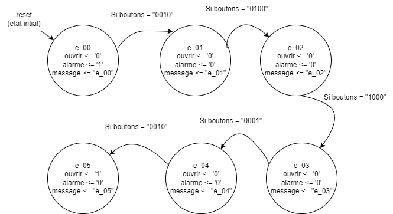
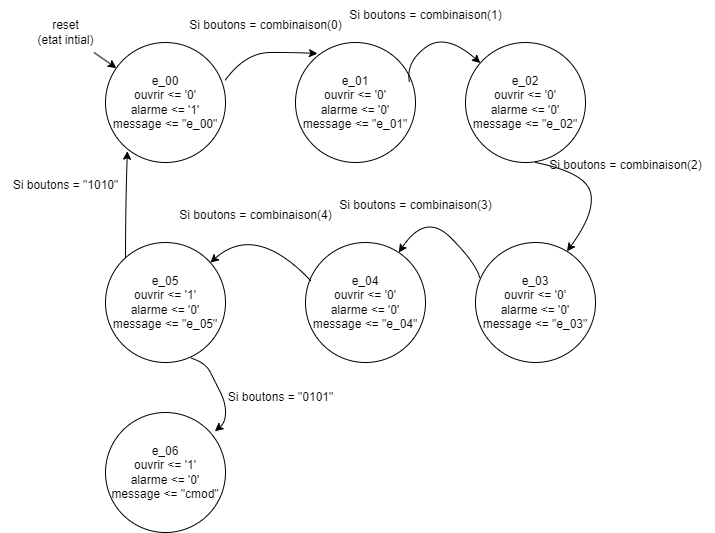

------------------------------------------------------------------------

# INF3500 - labo 3 - automne 2023
# Équipe **nom-d-équipe-ici**

Membre #1 : **Michaud, Maël, 2209239**

Membre #2 : **Rouleau, Thomas, 2221053**

------------------------------------------------------------------------

## Parties 1 et 2

Nous avons complété les spécifications de la partie 1.

Voici un résumé des modifications que nous avons apportées pour la partie 1 :
- Ajouté les retours à l'état initial lorsqu'un mauvais bouton de la combinaison est appuyé.
- Modification du test bench
- Assurer que la combinaison est bien entrée avant de passer à l'état `ouvert`.

Nous avons complété les spécifications de la partie 2.

Voici un résumé des modifications que nous avons apportées pour la partie 2 :
- ajout d'un 6ième état
- Utilisation d'une liste de combinaisons plutôt qu'un code unique
- Ajout d'enregistrement d'un nouveau code
- Ajout d'une réinitialisation du cadenans sans reset

Voici un lien vers notre code modifié (incluant, le cas échéant, le bonus): [cadenas_labo_3.vhd](sources/cadenas_labo_3.vhd).

Voici un lien vers notre code banc d'essai modifié (incluant, le cas échéant, le bonus) : [cadenas_labo_3_tb.vhd](sources/cadenas_labo_3_tb.vhd).

Voici notre diagramme d'états de la partie 1 :

Voici notre nouveau diagramme d'états de la partie 2 :

**Faire un choix et garder seulement une option.**
Nous utilisons la carte Basys 3.

Voici un lien vers notre fichier de configuration final : [top_labo_3.bit](synthese-implementation/top_labo_3.bit)

## Partie 3: Bonus

Nous n'avons pas complété le bonus. Nous nous concentrons sur notre réussite dans ce cours et dans d'autres.