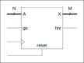

-----------------------------------------------------------------------
<table>
<tr>
<td></td>
<td><h2>INF3500 - Conception et réalisation de systèmes numériques
  Automne 2023
  Laboratoire #4 : Conception de chemins des données
</h2></td>
</tr>
</table>

----------------------------------------------------------------------------------------------

# Le calcul de la racine carrée par la méthode de Newton

----------------------------------------------------------------------------------------------

À la fin de ce laboratoire, vous devrez être capable de :

- Concevoir et modéliser en VHDL un chemin des données qui réalise des fonctions arithmétiques et logiques complexes au niveau du transfert entre registres (_Register Transfer Level_ – RTL). (B5)
    - Instancier des registres, dont des compteurs
    - Implémenter les fonctions arithmétiques et logiques pour les valeurs des registres, correspondant à une spécification par micro-opérations ou par pseudocode
- Composer un banc d’essai pour stimuler un modèle VHDL d’un chemin des données. (B5)
    - Générer un signal d'horloge et un signal de réinitialisation
    - Générer et appliquer des stimuli à un circuit séquentiel
    - Comparer les sorties du circuit à des réponses attendues pré-calculées
    - Utiliser des énoncés `assert` ou des conditions pour vérifier le module
    - Générer un chronogramme résultant de l’exécution du banc d’essai, et l'utiliser pour déboguer le circuit, entre autres pour résoudre les problèmes de synchronisation
- Implémenter un chemin des données sur un FPGA
    - Effectuer la synthèse et l'implémentation du circuit
    - Extraire, analyser et interpréter des métriques de coût d'implémentation
    - Programmer le FPGA et vérifier le fonctionnement correct du circuit avec les interfaces de la planchette
    - Communiquer avec le circuit via l'interface série d'un ordinateur

Ce laboratoire s'appuie principalement sur le matériel suivant :
1. Les procédures utilisées et les habiletés développées dans les laboratoires #1, #2 et #3.
2. La matière des cours des semaines 4 (Modélisation et vérification de circuits séquentiels), 5 (Conception de chemins des données) et 6 (Conception et implémentation de fonctions arithmétiques sur FPGA).

## Partie 0 : Introduction

### Préparatifs

- Créez un répertoire "inf3500\labo4\" dans lequel vous mettrez tous les fichiers de ce laboratoire.
- Importez tous les fichiers du laboratoire à partir de l'entrepôt Git et placez-les dans votre répertoire \labo4\.

### Vue d'ensemble

Dans cet exercice de laboratoire, on considère le problème de la conception d'un module qui calcule la racine carrée X d'un nombre A, (A = X &times; X). Ce module pourrait être ajouté à un microprocesseur pour en augmenter le jeu d'instructions.

La figure suivante illustre l'interface du module avec le monde extérieur. Les différents ports du module sont comme suit :
- Le nombre `A` est un entier non signé (nécessairement positif) exprimé avec N bits.
- La racine carrée `X` est un nombre qui pourrait être fractionnaire, exprimé avec M bits : N / 2 bits pour la partie entière et (M - N / 2) bits pour la partie fractionnaire.
- Les calculs sont lancés quand le signal `go` a la valeur '1' lors d'une transition positive du signal d'horloge `clk`. Le signal `fini` prend alors la valeur '0'.
- Le signal `fini` prend la valeur '1' quand les calculs sont terminés, indiquant que le port `X` représente alors la racine carrée de `A`.
- Le module est réinitialisé quand on place un '1' sur le port `reset`.

### Calcul de la racine carrée par la méthode itérative de Newton

On peut calculer la racine carrée X = sqrt(A) d'un nombre A par [la méthode itérative de Newton](https://fr.wikipedia.org/wiki/M%C3%A9thode_de_Newton#Racine_carr%C3%A9e).

À chaque itération k, on calcule : Xk+1 = (Xk + A / Xk) / 2, et la valeur de Xk converge vers X = sqrt(A) après quelques itérations.

Par exemple, pour A = 42871 et X0 = 255, on obtiendrait la séquence montrée au tableau suivant en effectuant la division à l'aide d'une calculatrice et en arrondissant les Xk à l'entier le plus proche à chaque étape. La valeur finale après trois itérations, 207, est très proche de la racine carrée qui est ~207.0531.

k | Xk
---- | ------
0 | 255
1 | 212
2 | 207

En pratique, et quand on n'a pas accès à une calculatrice, il y a plusieurs considérations à prendre en compte pour implémenter ces calculs avec un chemin des données :
- quelle précision choisir (combien de bits) pour représenter les calculs intermédiaires à l'intérieur du module;
- quelle valeur choisir pour X0; et,
- comment implémenter la division.

### Pseudocode et micro-opérations

Le calcul de la racine carrée par la méthode itérative de Newton peut se modéliser avec le pseudocode et les micro-opérations suivantes. Ce pseudocode décrit une machine à états à deux états : {attente, calculs}.

    si reset == '1' {
        etat ← "attente";
    } sinon, répéter à chaque coup d'horloge {
        dans le cas où etat == "attente" {
            si go = '1' alors {
                k ← 0;
                A_int ← A;
                xk ← 255; -- la valeur X255 est valide pour les cas où A est dans l'intervalle [0, 65535]
                etat ← "calculs";
            }
        }
        dans le cas où etat == "calculs" {
            fini ← 0;
            xk ← (xk + A / xk) / 2;
            k ← k + 1;
            si k = kmax alors {
                etat ← "attente";
            }
        }
    }
    X ← xk;
    si etat = "attente" {
        fini ← 1;
    } sinon {
        fini ← 0;
    }

### Implémentation de la division

La division générale n'est pas prise en charge par les outils de synthèse. Les diapositives de la semaine #6 présentent trois techniques synthétisables pour calculer la division générale. Pour ce laboratoire, on vous fournit un module de division générale par la technique de la réciproque dans le fichier [division_par_reciproque.vhd](sources/division_par_reciproque.vhd). Ce module est similaire à celui présenté dans les diapositives de la semaine #6.

Inspectez le code et les explications dans les diapositives pour en comprendre le fonctionnement.

Pour ce laboratoire, une valeur de W_frac de 14 bits semble produire de bons résultats. Vous pouvez expérimenter avec cette valeur et voir l'effet sur la précision des calculs et les coûts d'implémentation.

## Partie 1 : conception du module de racine carrée et modélisation en VHDL

Complétez la modélisation du module de la racine carrée donné dans le fichier [racine_carree.vhd](sources/racine_carree.vhd).

Pour les besoins de ce laboratoire, vous devriez choisir `N` = 16, `M` = 8, `kmax` = 10, et `W_frac` = 14.

*Attention* : VHDL étant VHDL, le plus grand défi est peut-être dans le codage de l'opération xk ← (xk + A / xk) / 2.
- La division A / xk doit être produite par le module [division_par_reciproque.vhd](sources/division_par_reciproque.vhd) ou par un module de votre conception. Attention, ce module retourne un quotient sur 32 bits : 16 bits de partie entière et 14 bits de partie fractionnaire. Il faut enlever la partie fractionnaire et ne garder que les 8 bits les moins significatifs de la partie entière. Recommandation : faites-vous plusieurs exemples sur papier pour bien comprendre.
- L'addition de deux nombres de M bits produit une somme de M + 1 bits. Il faut calculer cette somme, la diviser par 2 selon l'opération, puis ramener la somme à M bits. Encore une fois, faites-vous des exemples sur papier. La fonction `RESIZE (ARG: UNSIGNED; NEW_SIZE: NATURAL) return UNSIGNED;` du package [numeric.std](https://www.csee.umbc.edu/portal/help/VHDL/numeric_std.vhdl) peut simplifier l'écriture du code.

À remettre pour la partie 1 : votre fichier modifié;

## Partie 2 : banc d'essai

Vérifiez le fonctionnement de votre module [racine_carree.vhd](sources/racine_carree.vhd) à l'aide du banc d'essai du fichier [racine_carree_tb.vhd](sources/racine_carree_tb.vhd).

Bonifiez le banc d'essai pour bien vérifier le fonctionnement de votre module. Commencez par vérifier quelques cas seulement. Il faut appliquer un nombre au port `A`, activer le signal `go`, attendre le bon nombre de coups d'horloge, puis inspecter la réponse.

Idéalement, votre banc d'essai ferait une stimulation exhaustive (avec tous les cas possibles de A) et calculerait l'erreur de votre module dans chaque cas. Quelle est l'erreur maximale ? L'erreur moyenne ?

À remettre pour la partie 2 : votre banc d'essai modifié;

## Partie 3 : implémentation sur la carte

Les fichiers suivants sont fournis pour aider à contrôler les interfaces de la carte et faire l'implémentation dans le FPGA. Ne les modifiez pas.
- [utilitaires_inf3500_pkg.vhd](sources/utilitaires_inf3500_pkg.vhd) : pour regrouper un ensemble de fonctions utiles pour les laboratoires du cours;
- [generateur_horloge_precis.vhd](sources/generateur_horloge_precis.vhd) : pour générer une horloge à une fréquence désirée à partir de l'horloge de la carte;
- [monopulseur.vhd](sources/monopulseur.vhd) : pour synchroniser les actions des humains avec l'horloge du système;
- [top_labo_4.vhd](sources/top_labo_4.vhd) : pour regrouper tous les fichiers lors de l'implémentation;
- [basys_3_top.xdc](xdc/basys_3_top.xdc), [nexys_a7_50t_top.xdc](xdc/nexys_a7_50t_top.xdc) et [nexys_a7_100t_top.xdc](xdc/nexys_a7_100t_top.xdc) : trois fichiers correspondant à trois cartes de développement différentes, pour établir des liens entre des identificateurs et des pattes du FPGA; et,
- [labo_4_synth_impl.tcl](synthese-implementation/labo_4_synth_impl.tcl) : pour regrouper les commandes à utiliser pour faire l'implémentation.

Inspectez le contenu du fichier [top_labo_4.vhd](sources/top_labo_4.vhd) pour connaître le pairage entre les ports de l'entité `racine_carree` et les périphériques d'entrées et de sortie de la carte : 
- Le port `reset` est relié au bouton du centre;
- Le port `go` est relié au bouton de droite;
- Les commutateurs permettent d'entrer le nombre A dont on cherche la racine carrée.
- Les boutons contrôlent ce qui est affiché.
- Le port `fini` est relié à la LED (0).
- La sortie X est reliée à l'affichage quadruple à 7 segments.

Faites la synthèse et l'implémentation de votre module pour votre carte. Vérifiez-en le fonctionnement.

Vous pouvez expérimenter avec la fréquence d'horloge si vous voulez observer les étapes intermédiaires de calcul.

À remettre pour la partie #3 :
- votre fichier de configuration final : [labo_4.bit](synthese-implementation/labo_4.bit);
- le nombre de ressources du FPGA utilisées par votre module (racine_carree.vhd seulement);
- le nombre de ressources du FPGA utilisées par votre système au complet (tous les fichiers du projet, incluant top_labo_4.vhd);

## Partie 4: Bonus

**Mise en garde**. *Compléter correctement les parties 1 et 2 peut donner une note de 17 / 20 (85%), ce qui peut normalement être interprété comme un A. La partie bonus demande du travail supplémentaire qui sort normalement des attentes du cours. Il n'est pas nécessaire de la compléter pour réussir le cours ni pour obtenir une bonne note. Il n'est pas recommandé de s'y attaquer si vous éprouvez des difficultés dans un autre cours. La partie bonus propose un défi supplémentaire pour les personnes qui souhaitent s'investir davantage dans le cours INF3500 en toute connaissance de cause.*

### 4a. Une meilleure estimation de X0

On peut réduire de moitié le nombre d'itérations nécessaires pour que l'algorithme converge en choisissant une meilleure valeur de X0 pour lancer l'algorithme. Pour N = 16 (avec A dans l'intervalle [0, 65535], de bonnes valeurs de départ X0 sont données au tableau suivant : 

A | X0
---- | ------
&gt; 16384 | 255
&gt; 4096 | 128
&gt; 1024 | 64
&gt; 256 | 32
&gt; 64 | 16
&le; 64 | 8

Modifiez votre module pour choisir une meilleure valeur de X0. Expérimentez avec des valeurs réduites du nombre d'itérations pour voir l'effet.

Donnez vos observations dans votre rapport.

### 4b. Modifier l'approche pour effectuer la division

Proposez une autre manière d'implémenter la division et faites-en l'essai dans votre module. Vous pouvez vous inspirez des notes de cours, en particulier l'algorithme de Goldschmidt, ou proposer votre propre méthode.

Expliquez vos changements et vos observations dans votre rapport.

## Remise

La remise se fait directement sur votre entrepôt Git. Faites un 'push' régulier de vos modifications, et faites un 'push' final avant la date limite de la remise. Respectez l'arborescence de fichiers originale. Consultez le barème de correction pour la liste des fichiers à remettre.

**Directives spéciales :**
- Ne modifiez pas les noms des fichiers, les noms des entités, les listes des `generics`, les listes des ports ni les noms des architectures.
- Remettez du code de très bonne qualité, lisible et bien aligné, bien commenté.
- Indiquez clairement la source de tout code que vous réutilisez ou duquel vous vous êtes inspiré/e.
- Modifiez et complétez le fichier [rapport.md](rapport.md), entre autres pour spécifier quelle carte vous utilisez.

## Barème de correction

Le barème de correction est progressif. Il est relativement facile d'obtenir une note de passage (> 10) au laboratoire et il faut mettre du travail pour obtenir l'équivalent d'un A (17/20). Obtenir une note plus élevée (jusqu'à 20/20) nécessite plus de travail que ce qui est normalement demandé dans le cadre du cours et plus que les 9 heures que vous devez normalement passer par semaine sur ce cours.

Critères | Points
-------- | ------
Partie 1 : Spécifications de base | 8
Partie 2 : Spécifications avancées | 7
Qualité, lisibilité et élégance du code : alignement, choix des identificateurs, qualité et pertinence des commentaires, respect des consignes de remise incluant les noms des fichiers, orthographe, etc. | 2
**Pleine réussite du labo** | **17**
Bonus partie 3a. Meilleure valeur de départ X0 | 2
Bonus partie 3b. Division modifiée | 1
**Maximum possible sur 20 points** | **20**

## Références pour creuser plus loin

Les liens suivants ont été vérifiés en février 2022.

- Aldec Active-HDL Manual : accessible en faisant F1 dans l'application, et accessible [à partir du site de Aldec](https://www.aldec.com/en/support/resources/documentation/manuals/).
- Tous les manuels de Xilinx :  <https://www.xilinx.com/products/design-tools/vivado/vivado-ml.html#documentation>
- Vivado Design Suite Tcl Command Reference Guide : <https://www.xilinx.com/content/dam/xilinx/support/documentation/sw_manuals/xilinx2021_1/ug835-vivado-tcl-commands.pdf>
- Vivado Design Suite User Guide - Design Flows Overview : <https://www.xilinx.com/support/documentation/sw_manuals/xilinx2020_2/ug892-vivado-design-flows-overview.pdf>
- Vivado Design Suite User Guide - Synthesis : <https://www.xilinx.com/support/documentation/sw_manuals/xilinx2020_2/ug901-vivado-synthesis.pdf>
- Vivado Design Suite User Guide - Implementation : <https://www.xilinx.com/support/documentation/sw_manuals/xilinx2020_2/ug904-vivado-implementation.pdf>
