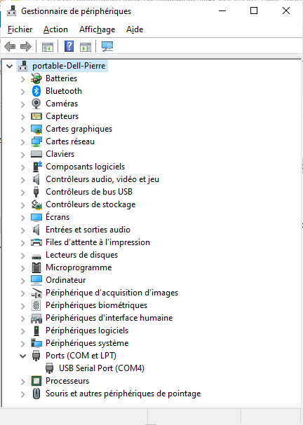
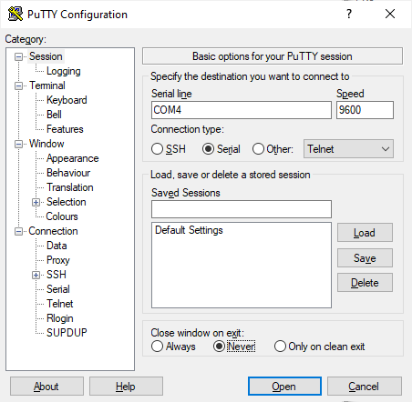
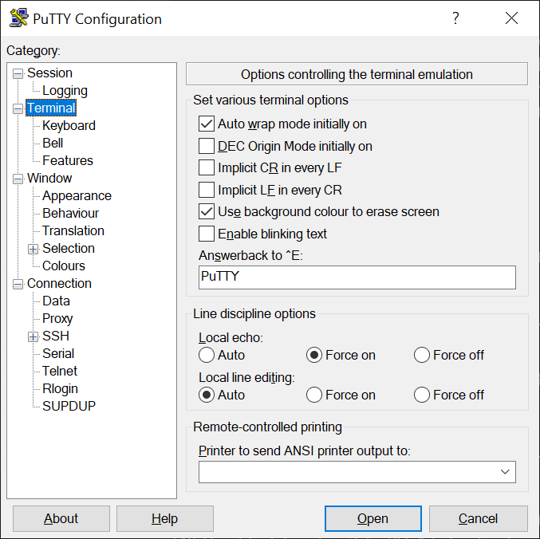
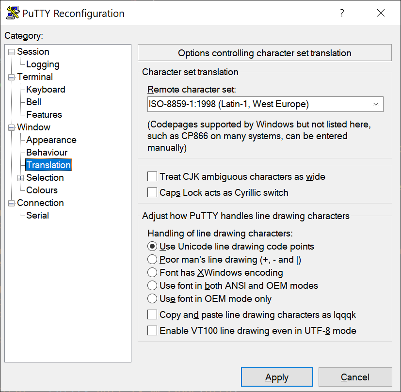
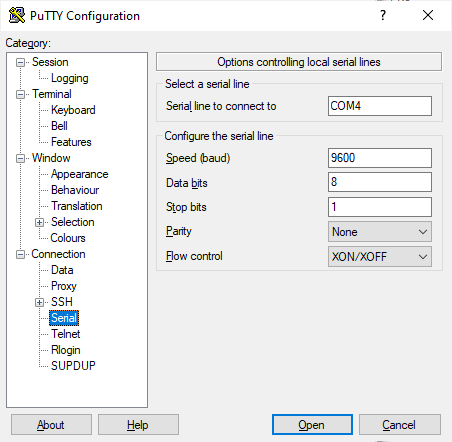

-----------------------------------------------------------------------
<table>
<tr>
<td></td>
<td><h2>INF3500 - Conception et réalisation de systèmes numériques
<br><br>Automne 2023
<br><br>Laboratoire #5 : Communications avec la carte
</h2></td>
</tr>
</table>

----------------------------------------------------------------------------------------------

# Communications sérielles avec un processeur

----------------------------------------------------------------------------------------------

Le but de ce laboratoire est de démontrer la possibilité de communiquer entre un ordinateur et un processeur implémenté sur une carte FPGA.

À la fin de ce laboratoire, vous devrez être capable de :
- Implémenter un chemin des données sur un FPGA
- Effectuer la synthèse et l'implémentation du circuit
- Programmer le FPGA et vérifier le fonctionnement correct du circuit avec les interfaces de la planchette
- Communiquer avec le chemin des données via l'interface série d'un ordinateur
- Décortiquer un code composé de plusieurs modules décrits dans plusieurs fichiers

Ce laboratoire s'appuie principalement sur le matériel suivant :
1. Les procédures utilisées et les habiletés développées dans les laboratoires #1 à #4.
2. La matière des cours des semaines 4 (Modélisation et vérification de circuits séquentiels), 5 (Conception de chemins des données) et 6 (Conception et implémentation de fonctions arithmétiques sur FPGA).

## Partie 0 : Introduction

### Communications série

Dans cet exercice de laboratoire, on exploite la communication série entre un ordinateur et la carte de développement à FPGA, ce qui simplifie grandement l'interface avec un être humain.

La communication série (un bit à la fois) avec la carte et le FPGA qui s'y trouve se fait par l'entremise du même câble qui sert aussi pour l'alimentation de la carte et pour la programmation du FPGA. Du côté de l'ordinateur, on utilise un port COM. Pour les ordinateurs contemporains et la plupart des ordinateurs portables, ce port COM est physiquement relié à un port USB.

De chaque côté de la communication série, on utilise un dispositif appelé [Universal Asynchronous Receiver Transmitter (UART)](https://fr.wikipedia.org/wiki/UART). Les UART communiquent entre eux par deux fils, chacun permettant de transmettre vers ou bien recevoir de l'autre UART. Les signaux sur ces fils respectent [une norme comme la RS-232](https://fr.wikipedia.org/wiki/RS-232). 

Les cartes Basys 3 et Nexys A7 ont des puces qui font le pont entre les connecteurs de la carte et des pattes spécifiques du FPGA (sur la Basys 3, ce sont A18 pour transmettre vers l'ordinateur, et B18 pour recevoir de l'ordinateur). Ces puces respectent la norme RS-232.

### Installer et configurer un outil de communications série sur votre ordinateur

Vous aurez besoin d'un utilitaire de communications série sur votre ordinateur.

Un [bon utilitaire gratuit pour Windows est PuTTY](https://putty.org/). Des [versions pour Linux et pour Mac](https://www.ssh.com/academy/ssh/putty), sont disponibles en ligne mais n'ont pas été testées pour ce laboratoire.

Vous devez d'abord établir quel port COM est disponible sur votre machine. Voici un exemple avec  Windows, pour lequel le port est COM4. *Vous devez identifier le port COM qui correspond à votre situation.*



Configurez ensuite PuTTY comme suit, avec le numéro de port COM trouvé à l'étape précédente :

<table>
<tr>
<td></td>
<td></td>
</tr>
<tr>
<td></td>
<td></td>
</tr>
</table>

Dans la fenêtre pour "Session", vous pouvez sauvegarder vos paramètres avec le bouton Save, avec un nom représentatif comme "Basys3", "FPGA", ou "INF3500-est-mon-cours-prefere".

Cliquez sur le bouton "Open" pour lancer une session. À partir de ce moment, tous les caractères  tapés dans la fenêtre de terminal sont envoyés sur le port COM spécifié, vers la carte FPGA. Comme on a choisi l'option "Force on" sous "Local echo", ces caractères apparaissent aussi à l'écran. Tous les caractères transmis par le FPGA et reçus sur le port COM sont aussi affichés dans la fenêtre.

## Le code ASCII

Les communications série entre l'ordinateur (via l'utilitaire PuTTY) et la carte se font par échange de caractères encodés en ASCII. [Le code ASCII](https://www.asciitable.com/) correspond au type `character` de VHDL. Ainsi, la cloche, la lettre 'A' et la lettre 'a' sont respectivement représentées par les code hexadécimaux 07h, 41h et 61h.

### Implémentation des fichiers de démonstration du laboratoire

Suivez les étapes suivantes :
- Créez un répertoire "inf3500\labo5\" dans lequel vous mettrez tous les fichiers de ce laboratoire.
- Importez tous les fichiers du laboratoire à partir de l'entrepôt Git et placez-les dans votre répertoire \labo5\.
- Faites la synthèse et l'implémentation des fichiers fournis à l'aide des commandes contenues dans le fichier [labo_5_synth_impl.tcl](synthese-implementation/labo_5_synth_impl.tcl).
- Lancez PuTTY ou votre programme de communications série et configurez-le tel que montré dans la partie 0.

Le processeur modélisé [dans le fichier PGFC3.vhd](sources/PGFC3.vhd) implémente le calcul itératif du plus grand facteur commun. C'est un problème jouet qui sert uniquement de prétexte à exercer les interfaces séries entre l'ordinateur et la carte FPGA.

Placez le commutateur 0 en position vers le haut (1) et observez ce qui se passe sur la carte quand vous entrez des chiffres dans la fenêtre de PuTTY.

Placez le commutateur en position vers le bas (0) et observez ce qui se passe sur la carte quand vous entrez des chiffres dans la fenêtre de PuTTY.

## Partie 1 : Analyse du code

### Diagramme de blocs du système

Produisez un diagramme de blocs du système au complet.

Votre diagramme doit inclure chaque instance de chaque entité avec son nom, montrer et identifier ses ports d'entrée et de sortie, et à quoi ces ports sont reliés. Évitez les spaghettis svp. Les ports peuvent reliés à des pattes du FPGA (dans le cas du module top_labo_5), ou à des ports d'autres modules.

Vous pouvez utiliser un programme pour faire des schémas ou faire un diagramme à la main et le numériser. Si vous remettez une numérisation, assurez-vous qu'elle soit de très bonne qualité, que le diagramme soit clair, que l'éclairage soit uniforme et que le diagramme soit droit. Si vous prenez une photo, assurez-vous que l'appareil soit au-dessus du dessin et dans le même plan que celui-ci.

### Description des modules

Décrivez en un paragraphe chacun le rôle et le fonctionnement des modules suivants :
- generateur_horloge_precis;
- monopulseur;
- uart_rx_char;
- uart_tx_char;
- uart_tx_message;
- interface_utilisateur;

### Analyse de quelques lignes de code

Expliquez ce que font les lignes de code VHDL suivantes et décortiquez chacune des opérations réalisées.

```
signal c1, c2 : character;
signal r1, r2 : std_logic_vector(7 downto 0);
...
r1 <= std_logic_vector(to_unsigned(character'pos(c1), 8));
c2 <= character'val(to_integer(unsigned(r2)));
```

Où se trouve la définition de la fonction `character_to_hex()` ?

### À remettre

À remettre pour la partie 1 : votre diagramme, votre description et vos réponses dans le fichier [rapport.md](rapport.md);

## Partie 2 : Remplacer le processeur par votre module de la racine carrée

Modifiez le code pour remplacer le processeur qui calcule le PGFC par votre module qui calcule la racine carrée, développé au laboratoire précédent.

Si votre module de racine carrée ne fonctionne pas, vous pouvez emprunter, avec leur accord explicite, le code d'une autre équipe sans pénalité. Expliquez complètement la situation dans votre rapport. Discutez-en avec le chargé de laboratoire aussi.

Remettez vos fichiers modifiés, minutieusement commentés, et vos explications [dans votre rapport](rapport.md);

Remettez aussi votre fichier de configuration final : [labo_5.bit](synthese-implementation/labo_5.bit).

## Partie 3: Bonus

**Mise en garde**. *Compléter correctement les parties 1 et 2 peut donner une note de 17 / 20 (85%), ce qui peut normalement être interprété comme un A. La partie bonus demande du travail supplémentaire qui sort normalement des attentes du cours. Il n'est pas nécessaire de la compléter pour réussir le cours ni pour obtenir une bonne note. Il n'est pas recommandé de s'y attaquer si vous éprouvez des difficultés dans un autre cours. La partie bonus propose un défi supplémentaire pour les personnes qui souhaitent s'investir davantage dans le cours INF3500 en toute connaissance de cause.*

### 3a. contrôle des erreurs à l'entrée

Modifiez le module interface.vhd pour qu'il traite correctement les entrées incorrectes, c'est à dire les caractères autres que {0 à 9} et {'A' à 'F'}.

Dans ce cas, l'interface doit afficher un message d'erreur à la console et demander une nouvelle entrée.

Expliquez clairement tous vos changements dans le code et dans votre rapport.

### 3b. affichage des résultats sur PuTTY

Modifiez le module d'interface pour que les résultats soient aussi affichés sur le terminal PuTTY.

Expliquez clairement tous vos changements dans le code et dans votre rapport.


## Remise

La remise se fait directement sur votre entrepôt Git. Faites un 'push' régulier de vos modifications, et faites un 'push' final avant la date limite de la remise. Respectez l'arborescence de fichiers originale. Consultez le barème de correction pour la liste des fichiers à remettre.

**Directives spéciales :**
- Ne modifiez pas les noms des fichiers, les noms des entités, les listes des `generics`, les listes des ports ni les noms des architectures.
- Remettez du code de très bonne qualité, lisible et bien aligné, bien commenté.
- Indiquez clairement la source de tout code que vous réutilisez ou duquel vous vous êtes inspiré/e.
- Modifiez et complétez le fichier [rapport.md](rapport.md), entre autres pour spécifier quelle carte vous utilisez.


## Barème de correction

Le barème de correction est progressif. Il est relativement facile d'obtenir une note de passage (> 10) au laboratoire et il faut mettre du travail pour obtenir l'équivalent d'un A (17/20). Obtenir une note plus élevée (jusqu'à 20/20) nécessite plus de travail que ce qui est normalement demandé dans le cadre du cours et plus que les 9 heures que vous devez normalement passer par semaine sur ce cours.

Critères | Points
-------- | ------
Partie 1 : Analyse du code | 6
Partie 2 : Avec votre module de la racine carrée | 9
Qualité, lisibilité et élégance du code : alignement, choix des identificateurs, qualité et pertinence des commentaires, respect des consignes de remise incluant les noms des fichiers, orthographe, etc. | 2
**Pleine réussite du labo** | **17**
Bonus partie 3a., contrôle des erreurs | 1.5
Bonus partie 3b., affichage des résultats sur le terminal | 1.5
**Maximum possible sur 20 points** | **20**


## Références pour creuser plus loin

Les liens suivants ont été vérifiés en février 2022.

- Aldec Active-HDL Manual : accessible en faisant F1 dans l'application, et accessible [à partir du site de Aldec](https://www.aldec.com/en/support/resources/documentation/manuals/).
- Tous les manuels de Xilinx :  <https://www.xilinx.com/products/design-tools/vivado/vivado-ml.html#documentation>
- Vivado Design Suite Tcl Command Reference Guide : <https://www.xilinx.com/content/dam/xilinx/support/documentation/sw_manuals/xilinx2021_1/ug835-vivado-tcl-commands.pdf>
- Vivado Design Suite User Guide - Design Flows Overview : <https://www.xilinx.com/support/documentation/sw_manuals/xilinx2020_2/ug892-vivado-design-flows-overview.pdf>
- Vivado Design Suite User Guide - Synthesis : <https://www.xilinx.com/support/documentation/sw_manuals/xilinx2020_2/ug901-vivado-synthesis.pdf>
- Vivado Design Suite User Guide - Implementation : <https://www.xilinx.com/support/documentation/sw_manuals/xilinx2020_2/ug904-vivado-implementation.pdf>
