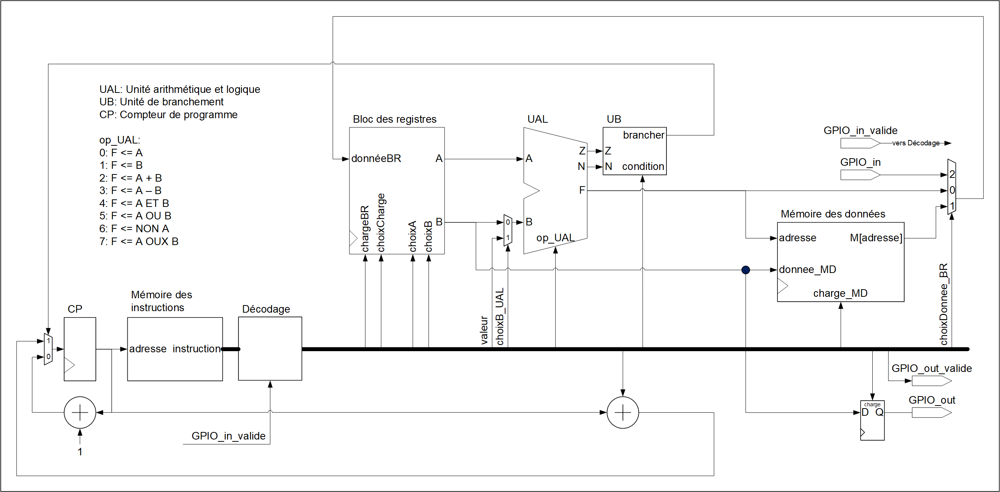

-----------------------------------------------------------------------
<table>
<tr>
<td></td>
<td><h2>
INF3500 - Conception et réalisation de systèmes numériques  
Automne 2023  
Laboratoire #6 : Processeur à usage général
</h2></td>
</tr>
</table>

------------------------------------------------------------------------

# Implémenter un processeur à usage général sur FPGA

------------------------------------------------------------------------

## Objectifs du laboratoire

À la fin de ce laboratoire, vous devrez être capable de :

- Analyser le chemin des données d’un processeur à usage général afin d’estimer les ressources requises, déterminer les limites opérationnelles du processeur, proposer des changements architecturaux pour implémenter de nouvelles opérations, et donner le code VHDL modifié. (B5)
- Proposer des modifications à l’unité de contrôle et à l’encodage des instructions pour ajouter de nouvelles instructions à un processeur à usage général, et donner le code VHDL modifié. (B5)

Ce laboratoire s'appuie sur le matériel suivant :
1. Les procédures utilisées et les habiletés développées dans les laboratoires précédents.
2. La matière de la semaine 9 (Conception de processeurs à usage général).

### Préparatifs

- Créez un répertoire inf3500\labo6\ dans lequel vous déposerez tous les fichiers de ce laboratoire.
- Importez tous les fichiers du laboratoire à partir de l'entrepôt Git et placez-les dans votre répertoire inf3500\labo6\
- Lancez Active-HD, créez un espace de travail (*workspace*) et créez un projet (*design*). Ajoutez-y tous les fichiers importés. Ou bien lancez et configurez votre environnement de travail préféré.

## Partie 0 : Introduction

Dans cet exercice de laboratoire, on considère l'implémentation d'un processeur à usage général modélisé en VHDL. Des modèles de processeurs ouverts existent et peuvent être analysés, simulés, modifiés, adaptés et implémentés par les utilisateurs dans la technologie de leur choix. Un exemple très populaire présentement est [le modèle de processeur (ou architecture de jeu d'instructions) RISC-V](https://fr.wikipedia.org/wiki/RISC-V). Dans ce laboratoire, nous utiliserons plutôt le modèle  du processeur PolyRISC développé expressément pour les besoins du cours INF3500.

### Retour sur le processeur PolyRISC

Le processeur PolyRISC a une architecture à jeu réduit d'instructions (*Reduced Instruction Set Computer* - RISC). Il comporte un chemin des données formé d'un bloc des registres, d'une UAL et d'une mémoire des données. Bien qu'on l'inclut ici, la mémoire des données n'est pas normalement considérée comme faisant partie du processeur. L'unité de contrôle est formée d'un compteur de programme, d'une mémoire des instructions, d'un bloc de décodage et d'une unité de branchement. Les diapositives et vidéos de la semaine #9 donnent tous les détails.

Le processeur PolyRISC inclut un registre d'entrée GPIO_in et un registre de sortie GPIO_out (*General Purpose Input-Output* - GPIO). Ces registres établissent des liens directs entre le monde extérieur et le chemin des données du processeur. Ils sont associés chacun avec un port de contrôle, respectivement GPIO_in_valide et GPIO_out_valide. (Attention, sur le diagramme, la sortie `GPIO_out_valide` est montrée sans registre, alors qu'il y a un registre de décrit dans le code VHDL.)

Pour les besoins de cet exercice, nous considérerons le cas où PolyRISC a un chemin des données de 32 bits de large, un bloc avec 16 registres et une mémoire des données de 256 mots. La mémoire des instructions a 256 mots de 32 bits.

Le processeur est décrit dans trois fichiers :
- La description principale : [PolyRISC_v10c.vhd](sources/PolyRISC_v10c.vhd);
- Un package qui définit des constantes et des types : [PolyRISC_utilitaires_pkg.vhd](sources/PolyRISC_utilitaires_pkg.vhd); et,
- Un package dans lequel se trouve un programme à exécuter : [PolyRISC_le_programme_pkg.vhd](sources/PolyRISC_le_programme_pkg.vhd).

Un banc d'essai très rudimentaire [PolyRISC_v10_tb.vhd](sources/PolyRISC_v10_tb.vhd) est fourni pour vérifier le processeur.

### Programme de démonstration : suite de Fibonacci

Considérez le fichier [PolyRISC_le_programme_pkg.vhd](sources/PolyRISC_le_programme_pkg.vhd) qui contient un programme pour le processeur PolyRISC pour calculer le n-ième nombre de la suite de Fibonacci.

Faites la simulation de ce code à l'aide du banc d'essai [PolyRISC_v10_tb.vhd](sources/PolyRISC_v10_tb.vhd). Créez un chronogramme et ajoutez-y tous les signaux de l'UUT. Lancez la simulation pour 500 ns.

Observez l’évolution de tous les signaux du processeur PolyRISC dans le chronogramme. Observez en particulier le compteur de programme CP, les différents champs du mot d'instruction, le bit de contrôle N et le contenu du bloc des registres

Dans le programme, les registres 0 à 5 du processeur sont assignées aux variables du code selon le tableau suivant :
Registre | Contenu
--------- | ------
lesRegistres[0] | compte maximal pour n
lesRegistres[1] | n
lesRegistres[2] | pas utilisé
lesRegistres[3] | nombre de Fibonacci F(n - 1)
lesRegistres[4] | nombre de Fibonacci F(n)
lesRegistres[5] | accumulateur

## Partie 1 : Le calcul de la racine carrée par recherche binaire

### Partie 1A : Le pseudocode

Considérez le pseudocode suivant pour le calcul de la racine carrée par recherche binaire. (Remerciements au [professeur Jean Pierre David](https://www.polymtl.ca/expertises/david-jean-pierre) d'avoir proposé cet algorithme dans un contexte éducatif.)

    nombre ← entrée externe;
    haut ← 32767; -- plus grand nombre positif exprimé sur 16 bits, son carré s'exprime sur 32 bits
    bas ← 0;
    compteur ← 16;
    tant que compteur > 0 {
        pivot ← (haut + bas) / 2;
        carre ← pivot × pivot;
        si carre > nombre {
            haut ← pivot;
        } sinon {
            bas ← pivot;
        }
        compteur ← compteur - 1;
    }
    sortie ← pivot;

Une grille de calcul est disponible [en ligne dans Google Sheets](https://docs.google.com/spreadsheets/d/14NFBw2-asRoSAr_94Gr6MDmZvIvUAwTvmQ5Ta1CaHco/edit?usp=sharing) pour vous permettre d'expérimenter avec différentes valeurs pour `nombre` et observer le déroulement de l'algorithme. Prenez une copie de la feuille afin de pouvoir l'éditer.

Par exemple pour nombre = 7985, on aurait la séquence suivante :

compteur | bas | haut | pivot | carre
-------: | --: | ---: | ----: | ----:
15 | 0 | 32767 | 16383 | 268402689
14 | 0 | 16383 | 8191 | 67092481
13 | 0 | 8191 | 4095 | 16769025
12 | 0 | 4095 | 2047 | 4190209
11 | 0 | 2047 | 1023 | 1046529
10 | 0 | 1023 | 511 | 261121
9 | 0 | 511 | 255 | 65025
8 | 0 | 255 | 127 | 16129
7 | 0 | 127 | 63 | 3969
6 | 63 | 127 | 95 | 9025
5 | 63 | 95 | 79 | 6241
4 | 79 | 95 | 87 | 7569
3 | 87 | 95 | 91 | 8281
2 | 87 | 91 | 89 | 7921
1 | 89 | 91 | 90 | 8100
0 | 89 | 90 | 89 | 7921

Il n'est pas possible de programmer le PolyRISC pour implémenter cet algorithme, parce qu'il manque la fonction de division par 2. Par ailleurs, bien qu'on pourrait réaliser la multiplication par des additions successives, ce serait plutôt lourd. Vous allez donc modifier le PolyRISC pour lui ajouter les instructions nécessaires.

### Partie 1B : Ajouter l'instruction RC := RA × RB à PolyRISC

Ajoutez l'instruction RC := RA × RB au processeur PolyRISC.

La multiplication de deux nombres de N bits génère un produit de 2N bits. Comme la largeur des registres de PolyRISC est de Wd bits, faites la multiplication des Wd / 2 bits les moins significatifs des registres A et B (en VHDL : `A(Wd / 2 - 1 downto 0) * B(Wd / 2 - 1 downto 0);)`. Le produit sera exprimé sur Wd bits, et pourra être entreposé dans le registre RC. Pour les besoins de ce laboratoire, on a fixé Wd à 32 bits dans le fichier [PolyRISC_utilitaires_pkg.vhd](sources/PolyRISC_utilitaires_pkg.vhd).

Inspectez le code du processeur pour comprendre comment les instructions sont encodées dans l'UAL, et ajoutez l'instruction de multiplication. Suivez les conventions observées dans ces deux fichiers autant que possible.

Modifiez le package [PolyRISC_utilitaires_pkg.vhd](sources/PolyRISC_utilitaires_pkg.vhd) pour ajouter une constante `AmulB` de valeur 11.

Modifiez le fichier [PolyRISC_v10c.vhd](sources/PolyRISC_v10c.vhd) pour ajouter la fonctionnalité de multiplication à la modélisation des opérations de l'UAL.

Pour être certains de n'avoir rien brisé, relancez la simulation pour le programme de Fibonacci.

### Partie 1C : Ajouter l'instruction RC := RA / 2 à PolyRISC

Ajoutez l'instruction RC := RA / 2 au processeur PolyRISC. Suivez la même procédure et les mêmes conventions que pour l'instruction de multiplication. Ajoutez une constante `Adiv2` de valeur 12.

Pour être certains de n'avoir rien brisé, relancez la simulation pour le programme de Fibonacci.

### Partie 1D : Coder l'algorithme du calcul de la racine carrée par recherche binaire

Écrivez un programme pour le PolyRISC correspondant au pseudocode de la partie 1A. Ajoutez votre programme dans le fichier [PolyRISC_le_programme_pkg.vhd](sources/PolyRISC_le_programme_pkg.vhd).

Exprimez votre programme avec des opérations sur les registres, puis encodez les opérations selon les spécifications de PolyRISC. Inspirez-vous du fichier de démonstration pour écrire votre code. Utilisez vos deux nouvelles instructions. Référez-vous aux diapositives du chapitre 9 des notes de cours pour bien comprendre l'encodage des instructions. Il y a deux défis pour écrire le programme :
- traduire le pseudocode en code assembleur pour PolyRISC; et,
- bien encoder les instructions de votre code assembleur selon la notation pour PolyRISC.

Ce travail serait fait normalement par un compilateur, à partir d'un langage comme Python ou C. Dans ce laboratoire on fait le travail à la main pour bien comprendre comment chacun des blocs de PolyRISC fonctionne.

Faites la simulation de votre programme pour confirmer qu'il fonctionne correctement. Testez avec plusieurs valeurs positives pour `nombre` entre 0 et 2^30 - 1.

### À remettre pour la partie 1

Remettez vos fichiers modifiés :
- [PolyRISC_v10c.vhd](sources/PolyRISC_v10c.vhd)
- [PolyRISC_utilitaires_pkg.vhd](sources/PolyRISC_utilitaires_pkg.vhd)
- [PolyRISC_le_programme_pkg.vhd](sources/PolyRISC_le_programme_pkg.vhd)
- [PolyRISC_v10_tb.vhd](sources/PolyRISC_v10_tb.vhd)

Ne modifiez pas le nom des fichiers, le nom des entités, la liste et le nom des ports, la liste et le nom des `generic`, le nom de l'architecture ni le nom du package.

Ajoutez des commentaires dans le fichier [rapport.md](rapport.md) qui expliquent brièvement vos travaux de cette partie.

## Partie 2 : Implémentation sur la planchette

Implémentez votre programme sur la planchette. Utilisez le fichier [top_labo_6.vhd](sources/top_labo_6.vhd). Observez comment les ports du processeur sont reliés aux ressources de la planchette. L'utilisateur doit spécifier les nombres à entrer à l'aide des commutateurs et du bouton `btnU`. Le bouton `btnC` sert de `reset`. Vérifiez le fonctionnement correct de votre processeur modifié.

Dans votre programme, vous pouvez ajouter des écritures vers la carte pour mieux voir le déroulement de celui-ci.

Le signal de contrôle `GPIO_in_valide` est relié à un bouton. Comme le processeur fonctionne à une horloge de 100 MHz, il est impossible de peser sur le bouton assez rapidement pour qu'on puisse entrer un seul nombre à la fois. Une horloge de 1 Hz est donc fournie au processeur. Vous pouvez expérimenter avec différentes fréquences d'horloge.

Utilisez le fichier de commandes [labo_6_synth_impl.tcl](synthese-implementation/labo_6_synth_impl.tcl) et le fichier de contraintes .xdc correspondant à votre planchette. Commentez et décommentez les lignes appropriées du fichier .tcl selon la planchette que vous utilisez.

À remettre :
- Votre fichier de configuration top_labo_6.bit.
- Des commentaires dans le fichier [rapport.md](rapport.md) qui expliquent brièvement vos expériences et observations.

## Partie 3 : Ressources pour implémenter le processeur PolyRISC

Mesurez la quantité de ressources nécessaires (Slice LUTs, Slice Registers, F7 Muxes, F8 Muxes, Bonded IOB) pour implémenter le processeur PolyRISC pour les cas suivants. Ne mesurez les coûts que pour le processeur (fichiers [PolyRISC_v10c.vhd](sources/PolyRISC_v10c.vhd) originial et modifié), n'incluez pas le fichier [top_labo_6.vhd](sources/top_labo_6.vhd).

Nreg | Wd | Mi | Md | version du processeur
---- | -- | -- | -- | ---------------------
16 | 32 | 8 | 8 | version de base fournie avec ce laboratoire
32 | 32 | 8 | 8 | version de base fournie avec ce laboratoire
16 | 64 | 8 | 8 | version de base fournie avec ce laboratoire
32 | 64 | 8 | 8 | version de base fournie avec ce laboratoire
16 | 32 | 8 | 8 | votre version avec les instructions de la partie 1
32 | 32 | 8 | 8 | votre version avec les instructions de la partie 1
16 | 64 | 8 | 8 | votre version avec les instructions de la partie 1
32 | 64 | 8 | 8 | votre version avec les instructions de la partie 1

Avec l'organisation actuelle du code, vous devrez modifier le fichier [PolyRISC_utilitaires_pkg.vhd](sources/PolyRISC_utilitaires_pkg.vhd) pour varier les paramètres Nreg et Wd.

Notez les statistiques dans votre [rapport.md](rapport.md). Analysez et commentez complètement vos résultats. Comment expliquez vous la progression du nombre de ressources utilisées selon les valeurs de Nreg, Wd, Mi et Md, et de la version du processeur ?

## Partie 4 : Bonus

**Mise en garde**. *Compléter correctement les parties 1 et 2 peut donner une note de 17 / 20 (85%), ce qui peut normalement être interprété comme un A. La partie bonus demande du travail supplémentaire qui sort normalement des attentes du cours. Il n'est pas nécessaire de la compléter pour réussir le cours ni pour obtenir une bonne note. Il n'est pas recommandé de s'y attaquer si vous éprouvez des difficultés dans un autre cours. La partie bonus propose un défi supplémentaire pour les personnes qui souhaitent s'investir davantage dans le cours INF3500 en toute connaissance de cause.*

### Partie 4A. Affichage dans une console sur l'ordinateur

Utilisez le code fourni au laboratoire #5 pour afficher la sortie du PolyRISC à la console, en reliant le port GPIO_out du PolyRISC à la console via PuTTY ou un autre programme de votre choix.

Vous ne devriez pas avoir à modifier ni votre description du processeur ni votre programme, seules des modifications au fichier top_labo_6 devraient suffire. 

### Partie 4B. Prendre l'entrée de la console sur l'ordinateur

Utilisez le code fourni au laboratoire #5 pour relier le port GPIO_in du PolyRISC à la console via PuTTY ou un autre programme de votre choix.

Vous ne devriez pas avoir à modifier ni votre description du processeur ni votre programme, seules des modifications au fichier top_labo_6 devraient suffire.

## Remise

La remise se fait directement sur votre entrepôt Git. Poussez régulièrement vos modifications, incluant pour la version finale de vos fichiers avant l'heure et la date limite de la remise. Consultez l'ébauche du fichier [rapport.md](rapport.md) pour la liste des fichiers à remettre.

**Directives spéciales :**
- Ne modifiez pas les noms des fichiers, les noms des entités, les listes des ports, les listes des `generics` ni les noms des architectures.
- Remettez du code de très bonne qualité, lisible et bien aligné, bien commenté. Indiquez clairement la source de tout code que vous réutilisez ou duquel vous vous êtes inspiré/e.
- Modifiez et complétez le fichier [rapport.md](rapport.md) pour donner des détails supplémentaires sur votre code. Spécifiez quelle carte vous utilisez.

## Barème de correction

Le barème de correction est progressif. Il est relativement facile d'obtenir une note de passage (> 10) au laboratoire et il faut mettre du travail pour obtenir l'équivalent d'un A (17/20).

Critères | Points
-------- | -----:
Partie 1B : Ajout de l'instruction RC := RA × RB à PolyRISC | 2
Partie 1C : Ajout de l'instruction RC := RA / 2 à PolyRISC | 2
Partie 1D : Code assembleur pour l'algorithme de la racine carrée | 5
Partie 2 : Implémentation sur la planchette | 2
Partie 3 : Ressources et analyse | 4
Qualité, lisibilité et élégance du code : alignement, choix des identificateurs, qualité et pertinence des commentaires, respect des consignes de remise incluant les noms des fichiers, orthographe, etc. | 2
**Pleine réussite du labo** | **17**
Bonus partie 4a., sortie à la console | 1.5
Bonus partie 4b., entrée par la console | 1.5
**Maximum possible sur 20 points** | **20**

## Références pour creuser plus loin

Les liens suivants ont été vérifiés en février 2022.

- Aldec Active-HDL Manual : accessible en faisant F1 dans l'application, et accessible [à partir du site de Aldec](https://www.aldec.com/en/support/resources/documentation/manuals/).
- Tous les manuels de Xilinx :  <https://www.xilinx.com/products/design-tools/vivado/vivado-ml.html#documentation>
- Vivado Design Suite Tcl Command Reference Guide : <https://www.xilinx.com/content/dam/xilinx/support/documentation/sw_manuals/xilinx2021_1/ug835-vivado-tcl-commands.pdf>
- Vivado Design Suite User Guide - Design Flows Overview : <https://www.xilinx.com/support/documentation/sw_manuals/xilinx2020_2/ug892-vivado-design-flows-overview.pdf>
- Vivado Design Suite User Guide - Synthesis : <https://www.xilinx.com/support/documentation/sw_manuals/xilinx2020_2/ug901-vivado-synthesis.pdf>
- Vivado Design Suite User Guide - Implementation : <https://www.xilinx.com/support/documentation/sw_manuals/xilinx2020_2/ug904-vivado-implementation.pdf>
